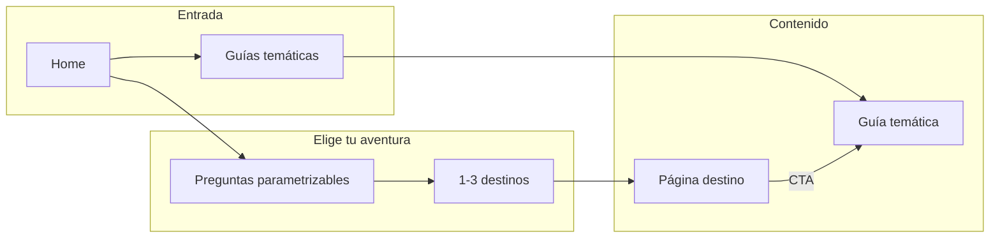

# Plan: App de viajes (idea 6) – v0

Documento único del plan actualizado con modelo parametrizable, destinos Argentina, guías no solo Argentina y uso de DolarAPI. **Firebase proyecto para-donde creado; listo para comenzar implementación.**

---

## Contexto

- **Nombre:** **Para Dónde?** (marca/dominio: paradonde; ej. paradonde.com cuando se registre).
- **Producto:** Recopilador de guías de viajes + "Elige tu aventura" (preguntas → destinos sugeridos → guía + reseñas externas). Foco trámites/derechos; **"aventura" v0 solo Argentina**; guías temáticas y calculadoras útiles para **Argentina y exterior**.
- **Especificación:** [agrupaciones/06-app-viajes.md](agrupaciones/06-app-viajes.md)
- **Stack (obligatorio):** [TECNOLOGIA-Y-HOSTING.md](TECNOLOGIA-Y-HOSTING.md): React + Ionic + Capacitor; hosting Firebase Hosting; opcional después Firebase Auth/Firestore.
- **Referencia de estructura:** Proyecto [AlDia](AlDia/) (React + Ionic + Vite, pages/components/services/hooks).

**Firebase (listo):** Proyecto **para-donde** creado en consola. `projectId`: para-donde; `authDomain`: para-donde.firebaseapp.com; Hosting y Analytics disponibles. La config (`firebaseConfig`) debe vivir en el repo en `src/firebase.ts` (o similar); si el repo es público, usar variables de entorno para `apiKey` y no subir claves (ej. `.env` en `.gitignore`, `.env.example` sin valores). Deploy con `firebase use para-donde` y `firebase deploy` desde la carpeta del proyecto.

**Nombres en exploración** (corto, esencia de guía virtual, tono místico/fantasía — tipo “gran viajero”, Señor de los Anillos):
- **Senda** — el camino; corto, poético.
- **Rumbo** — dirección, rumbo del viaje; una palabra.
- **Vigía** — quien ve el camino desde arriba; guía.
- **Peregrino** — el que viaja con propósito; evocador.
- **Caminante** — como los montaraces; viajero que conoce la ruta.
- **Bitácora** — cuaderno de ruta; guía + registro.
- **Atalaya** — torre que ve lejos; quien orienta.
- **Umbral** — el paso al viaje; inicio del camino.
- **Estela** — la huella del viaje; lo que deja el camino.
- **Gran Viajero** — el ejemplo; un poco más largo.
- **La Brújula** / **Brújula** — lo que orienta; muy claro como guía.
- **El Vigía** — el que custodia y orienta el camino.

*(Elegir uno y usarlo como nombre/marca; dominio a registrar después si aplica.)*

---

## Qué podemos necesitar (resumen)

| Área | Necesidad |
|------|------------|
| **Proyecto** | Carpeta `Paradonde/` (app: Para Dónde?; dominio paradonde a registrar cuando corresponda). React + Ionic + Capacitor + Vite, mismo patrón que AlDia. |
| **Contenido** | Todo **parametrizable** en repo: preguntas y opciones del "aventura" en config; destinos con **atributos** que mapean a esas opciones; guías temáticas (no solo Argentina). **Sin APIs externas** para destinos ni aventura en v0. |
| **Lógica "aventura"** | Motor en front: respuestas del usuario → filtrar destinos cuyo perfil (atributos) coincida; ordenar por coincidencias; devolver 1–3. Fácil agregar destinos o cambiar preguntas editando datos. |
| **APIs v0** | Solo **DolarAPI** para calculadora "gasté X USD con tarjeta → resumen en pesos" (lo pide la gente; ver 06-app-viajes.md). Resto sin API. |
| **Rutas y pantallas** | Home, flujo aventura (preguntas + resultado), página por destino, listado de guías temáticas, página por guía. |
| **SEO y compartir** | Rutas amigables, meta tags por página, URL compartible del resultado "aventura" (query o path). |
| **Monetización v0** | Enlaces de afiliados (Booking, Despegar, seguros) con divulgación; opcional captura de email para PDF. |
| **Hosting** | Firebase Hosting; proyecto **para-donde** creado. Sin Firestore/Auth en v0. Listo para implementación. |

---

## 1. Setup del proyecto

- Crear proyecto en carpeta **`Paradonde/`** (app: Para Dónde?): **Vite + React + TypeScript**, luego **Ionic React** y **Capacitor** (igual que AlDia).
- Estructura sugerida:
  - `src/pages/`: Home, Aventura (flujo), Destino, GuiasTematicas, GuiaTematica.
  - `src/components/`: preguntas del flujo, cards de destino, bloques de guía, enlaces oficiales.
  - `src/services/` o `src/logic/`: motor aventura (input respuestas → destinos); opcional servicio DolarAPI para calculadora.
  - `src/data/`: **parametrizable** – preguntas aventura, destinos (atributos + guía + reseñas), guías temáticas.
- React Router: `/`, `/aventura`, `/aventura/resultado`, `/destino/:slug`, `/guias`, `/guias/:slug`.
- **Firebase:** Proyecto **para-donde** ya creado. En el código: `initializeApp(firebaseConfig)` y opcionalmente `getAnalytics(app)` en `src/firebase.ts`. Config disponible; usar `.env` para claves si el repo es público. Tras `firebase init` en `Paradonde/`, usar `firebase use para-donde` y deploy con `firebase deploy`.

---

## 2. Modelo de datos parametrizable

Todo el contenido del "Elige tu aventura" y las guías se arma fácilmente desde datos en el repo (sin API en v0).

### 2.1 Preguntas y opciones (config)

- **Origen:** `src/data/aventura.ts` (o similar). Array **`preguntasAventura`**: cada pregunta tiene `id`, `label` y `opciones[]` (cada opción: `id`, `label`).
- Ejemplos de preguntas: **compañía** (solo, pareja, amigos, familia), **tipo experiencia** (playa y relax, montaña y naturaleza, ciudad y cultura, aventura y deporte, gastronomía y vino, termas y relax), **presupuesto** (económico, medio, sin mirar tanto), **días** (fin de semana, una semana, dos o más). Para v0 solo Argentina puede omitirse pregunta "región" o tener una sola opción "Argentina".
- Agregar o cambiar preguntas/opciones = solo editar este config.

### 2.2 Destinos (solo Argentina en v0 para "aventura")

- **Origen:** `src/data/destinos.ts`. Cada destino: `id`, `slug`, `nombre`, `descripcionCorta`, **`atributos`** (objeto que mapea cada `preguntaId` a una o varias opciones con las que "cuadra" ese destino), `guia` (qué ver, cuándo ir, cuántos días, tips), `reseñasExternas` (TripAdvisor/Booking: puntaje, cantidad, URL).
- **Lista inicial – 10 destinos más buscados en Argentina** (fuentes: rankings y búsquedas 2025):
  1. Buenos Aires  
  2. San Carlos de Bariloche  
  3. Mar del Plata  
  4. Córdoba  
  5. Villa Carlos Paz  
  6. Mendoza  
  7. Puerto Iguazú  
  8. Salta  
  9. Termas de Río Hondo  
  10. Rosario  

  Los textos y atributos se definen en el repo. **Agregar un destino nuevo** = agregar un objeto con su perfil de atributos (y guía, reseñas).

- **Motor:** Dadas las respuestas del usuario (preguntaId → opcionId), filtrar destinos donde para cada respuesta el destino tenga esa opción en su `atributos`; ordenar por cantidad de coincidencias; devolver 1–3. Así "llegar al nombre del destino" es solo consultar este dataset parametrizable.

### 2.3 Guías temáticas (no solo Argentina)

- **Origen:** `src/data/guias.ts` (o MD/JSON por guía). Contenido **parametrizable** y pensado para **Argentina y exterior** donde aplique: documentación para viajar (pasaporte, visa, seguro, vacunas, menores, mascotas), vuelo cancelado/demorado (derechos, ANAC), equipaje extraviado/dañado, qué llevar (checklist), pagar en el exterior (dólar tarjeta, límites). Enlaces a sitios oficiales (Argentina.gob.ar, Cancillería, ANAC, SENASA).

### 2.4 Reseñas en v0

- Solo resumen por destino (puntaje + nº opiniones + link). Sin comentarios de usuarios ni base de datos. Datos manuales en cada entrada de destino.

---

## 3. APIs (solo lo necesario en v0)

- **Destinos y "aventura":** Ninguna API. Todo desde config parametrizable en el repo.
- **Calculadora "gasté X USD con tarjeta → resumen en pesos":** Usar **DolarAPI** (`GET https://dolarapi.com/v1/dolares/tarjeta`), igual que en AlDia. La investigación en 06-app-viajes.md indica que la gente lo pide; incluir en v0 si se incluye la calculadora.
- Otras calculadoras (presupuesto viaje, etc.): datos estáticos o fórmulas en cliente; sin API salvo que más adelante se decida lo contrario.

---

## 4. Flujos de usuario v0

- **Home:** Entrada al "Elige tu aventura" + acceso a guías temáticas + (opcional) calculadoras (presupuesto, dólar tarjeta con DolarAPI).
- **Elige tu aventura:** Una pregunta por pantalla (o pocas por página), siguiente/atrás; al finalizar → resultado con 1–3 destinos sugeridos con breve razón; cada uno enlaza a `/destino/:slug`.
- **Página destino:** Guía corta + bloque "En TripAdvisor X/5 (N opiniones)" con link + Booking si aplica; CTAs: "Ver guía completa", "Ver alojamientos en Booking" (afiliado), "Armar mi checklist".
- **Guías temáticas:** Listado en `/guias`; cada guía en `/guias/:slug` con texto y enlaces oficiales.

---

## 5. Funcionalidades opcionales para v0

- **Calculadora "Presupuesto viaje":** Días + tipo destino (económico/medio/alto) + moneda → estimación orientativa (datos estáticos).
- **Calculadora "Gasté X USD con tarjeta → resumen en pesos":** Usar **DolarAPI** para cotización en vivo (recomendado; la gente lo pide).
- **Checklist "Qué llevar":** Página estática o plantilla; opcional "armar mi checklist" para un destino.
- **Compartir resultado aventura:** Serializar respuestas en query params para que el link lleve al mismo resultado sin backend.

---

## 6. UI/UX y SEO

- **Ionic:** Componentes Ionic (IonPage, IonContent, botones, cards, inputs) para consistencia web y futura app.
- **SEO:** Título y meta description por ruta; títulos tipo "Documentación para viajar – Para Dónde?", "Bariloche – Guía y reseñas – Para Dónde?".
- **Afiliados:** Enlaces a Booking, Despegar, seguros con divulgación clara.

---

## Tema visual: Tierra y cielo (natural, Argentina sin cliché)

Dirección elegida: cautivador pero simple; sensación de mapa, ruta y paisaje sin caer en estereotipos.

- **Paleta:**
  - Fondos: off-white, crema (`#F8F6F3`, `#F5F2ED` o similar).
  - Acento principal: **terracota / óxido** (botones, links, elementos destacados).
  - Secundario: **verde salvia** o verde musgo (badges, estados, naturaleza).
  - Acento suave: **azul cielo muy pálido** (links secundarios, fondos de sección).
  - Texto: negro o gris muy oscuro; gris medio para texto secundario.

- **Tipografía:** Una sola familia con carácter; evitar Inter/Roboto. Sugerencia: **Plus Jakarta Sans**, **Outfit** o **DM Sans** (Google Fonts) para títulos y cuerpo.

- **Componentes:** Cards con bordes redondeados y sombra muy sutil; mucho espacio en blanco; fotos de destinos con overlay discreto o en bloques grandes. Botones y cards con el mismo estilo en toda la app.

- **Regla de simplicidad:** Pocos colores (3–4 en uso), una sola familia de fuentes; no abusar de gradientes ni efectos en v0.

---

## 7. Hosting y siguientes pasos post-v0

- **Deploy v0:** Build → Firebase Hosting (o Vercel/Netlify). Sin Firestore ni Auth.
- **Métricas:** Definir éxito v0 (visitas a "aventura", clics a guías, clics a afiliados). Opcional: Firebase Analytics.
- **Después de v0:** Comentarios de usuarios (Firebase Auth + Firestore); builds nativos con Capacitor; más destinos/regiones; TripAdvisor API u otras fuentes si se desea.

---

## Diagrama de flujo v0

---

## Orden sugerido de implementación

1. Setup: proyecto React + Ionic + Capacitor + Router + Firebase Hosting.
2. Datos parametrizables: `preguntasAventura` y 10 destinos Argentina en `src/data/` (atributos por destino).
3. Motor aventura: función respuestas → filtrar por atributos → destinos; pantallas de preguntas y resultado.
4. Páginas destino: layout + bloque reseñas externas + enlaces afiliados.
5. Guías temáticas: 3–5 guías con texto y links oficiales (no solo Argentina).
6. Home: enlace aventura + listado guías + (opcional) calculadoras.
7. Calculadora dólar tarjeta con DolarAPI si se incluye.
8. SEO: títulos y meta por ruta; URLs compartibles del resultado aventura.
9. Deploy y métrica de éxito v0.
